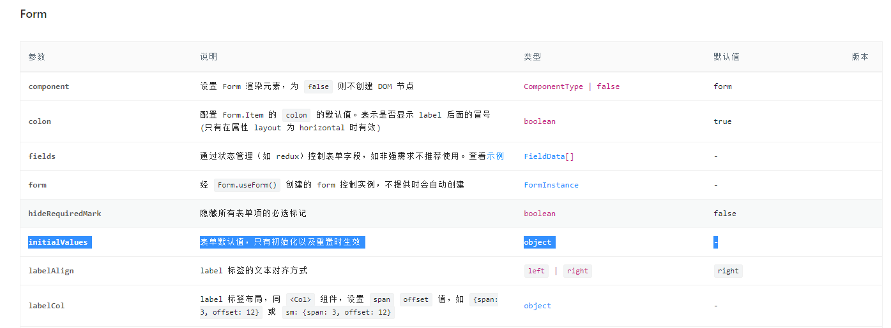
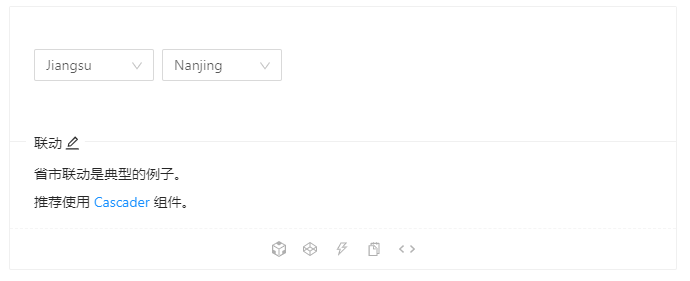

# 前言

最近做的项目前端是用React+Ant Design，在表单`<Form>`组件下，有好几个`<Form.Item>`，其中两个`<Form.Item>`下有`<Select>`，里面有固定的`<Option>`，具体如下图所示：

.png)

------

# Question1：`select选择器`的默认值提交后显示未定义

在[antd组件](https://ant.design/components/overview-cn/)中查看到，被设置了 `name` 属性的 `Form.Item` 包装的控件，表单控件会自动添加 `value`（或 `valuePropName` 指定的其他属性） `onChange`（或 `trigger` 指定的其他属性），数据同步将被 Form 接管，这会导致以下结果：

1. 你不再需要也不应该用 `onChange` 来做数据收集同步（你可以使用 Form 的 `onValuesChange`），但还是可以继续监听 `onChange` 事件。
2. 你不能用控件的 `value` 或 `defaultValue` 等属性来设置表单域的值，默认值可以用 Form 里的 `initialValues` 来设置。注意 `initialValues` 不能被 `setState` 动态更新，你需要用 `setFieldsValue` 来更新。
3. 你不应该用 `setState`，可以使用 `form.setFieldsValue` 来动态改变表单值。

<br>

<u>**简单的说，我遇到的问题正如第二段描述的那样，form控件很贴心的给我们准备了`initialValues`**</u> 



<u>**我们只需要在form控件中加入这个属性就行**</u>

```jsx
<Form
    name="xxx"
    initialValues={{   //赋初始值
    FactName: this.state.tempDataSource.FactName,
    manuType: this.state.tempDataSource.type,
    phone: this.state.tempDataSource.phone,
    proModel: this.state.tempDataSource.model,
    people: this.state.tempDataSource.people,
    }}
>
    ...
</Form>
```

------

# Question2：两个`select选择器`联动失效

我举官网上的示例说明一下这个问题




当我选择第一个select值为zhejiang时，第二个选择器自动选择默认的第一个值hangzhou

当我选择第一个select值为jiangsu时，第二个选择器自动选择默认的第一个值nanjing

<br>

**但是当你的select选择器嵌套在form表单时，select选择器中的value值失效了，就不能自动获取到另一个select选择器的value值，导致select选择器直接的联动失效，这时候该怎么办呢？**

<br>

我们可以通过 `ref` 获取数据域，步骤是：

1. 定义字段  formRef = React.createRef();
2. 在select选择器触发选择的函数里面添加   this.formRef.current.setFieldsValue({  ...  });
3. 在Form表单里添加属性    ref={this.formRef}

```jsx
class Demo extends React.Component {
    
	formRef = React.createRef<FormInstance>();

    onGenderChange = value => {
        this.formRef.current.setFieldsValue({
          ...//设置第二个select选择器的值
        });
      };

	render() {
        return (
      <Form  ref={this.formRef} name="xxx" onFinish={this.onFinish}>
                ...
                <Select onGenderChange>  ...   </Select>
                <Select>  ...   </Select>
      </Form>
            )
    }
```

<br>

<br>

<br>

<br>

<br>

<br>

<br>

**到此我遇到的两个问题解决了，如果你们有什么疑问或者遇到什么新的问题欢迎留言讨论！！！**

<br>

<br>

<br>

<br>

<br>

<br>

<br>