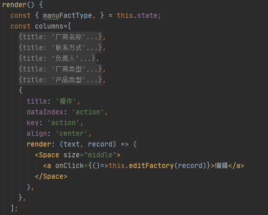

# 前言：

最近项目中，依然负责前端这一块，数据被装到Table表格里面，点击编辑需要自动获取到那一行的数据，然后自动打开一个Form表单窗口，把这一行的数据自动填上Form表单中作为初始值，最后你就可以通过Form表单修改内容，调用接口重新渲染一下数据，这就完成了编辑功能。

.png)

# 问题：如何获取那一行的数据

查阅官网[antd组件](https://ant.design/components/overview-cn/)里面有个render函数，描述情况是：render——生成复杂数据的渲染函数，参数分别为当前行的值，当前行数据，行索引，@return 里面可以设置表格行/列合并——function(text, record, index) {}

我要使用record来获取那一行数据，于是按下面图片写代码就实现了

**注：render一定要写两个参数（text, record），调用点击编辑函数onClick()一定要按上图所示，不然会报错！！！**

 

 

 

这么简单就能成功，但是过程是十分艰辛的，花了好几个小时，百度了好多文章，再叨唠一下，参数一定要加上，而且一定要用  `（）=> this.函数（record）` 这样才能获取到行数据，百度到的`this.函数.bind(rec)`我是不能成功，不知道你们能不能成功

 

老规矩，欢迎留言！