# 一、加快访问速度

hexo+github访问速度超慢！！！

- 原因：托管网站的github是外网，访问外网速度慢。

-  解决方法：采用hexo+github+coding

（coding：大家可以理解为中国版的github，如果把代码既托管到coding上，又托管到github上，让大陆的用户访问的是由coding托管的网站，境外的用户访问的是由github托管的网站，这样访问速度就能上去了）

## 1、创建[coding](https://coding.net/)账号

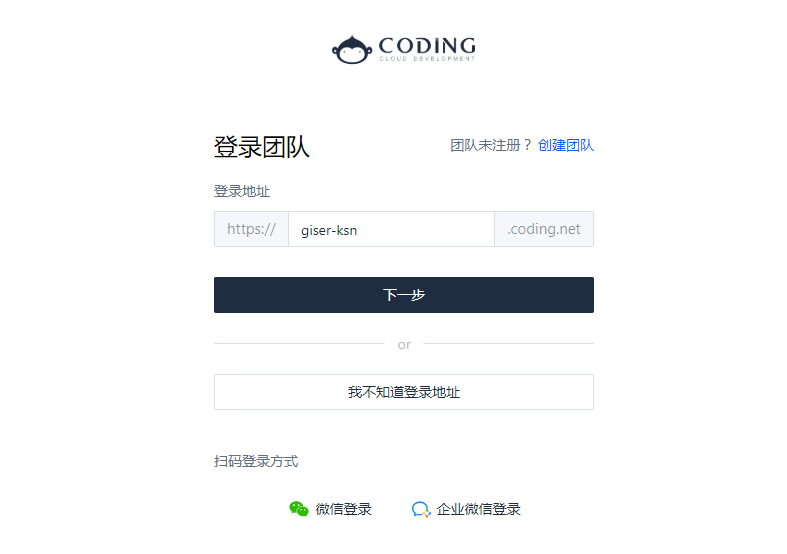

## 2、创建与账号同名的项目

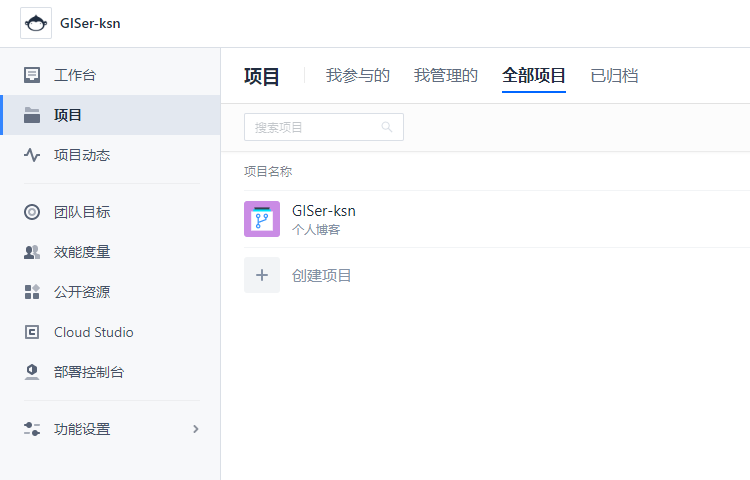

点击进入项目→右下角项目设置→功能开关，建议都打开，方便部署静态网站

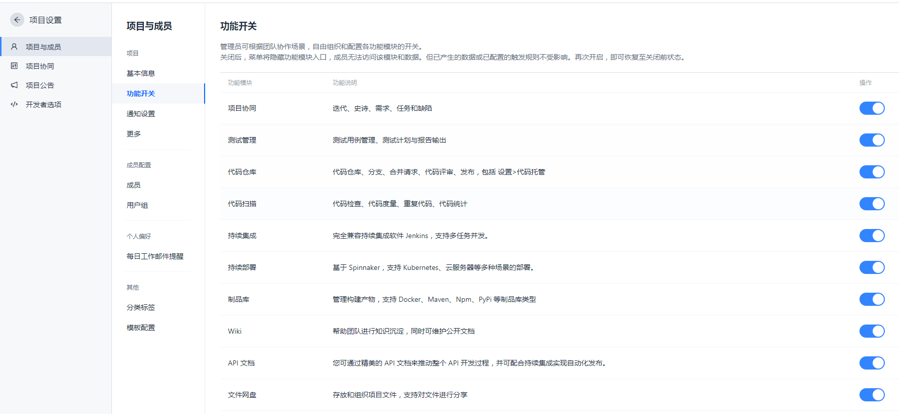

## 3、修改站点配置文件`_config.yml`

```
#格式一定要正确，不然会报错
deploy:
  type: 'git'
  repo: 
      github:
          https://github.com/xxx/xxx.github.io
      coding:
          https://e.coding.net/xxx/xxx/xxx.git
  branch: 'master'
```

主页→项目→xxx→代码仓库→设置，复制粘贴到coding下

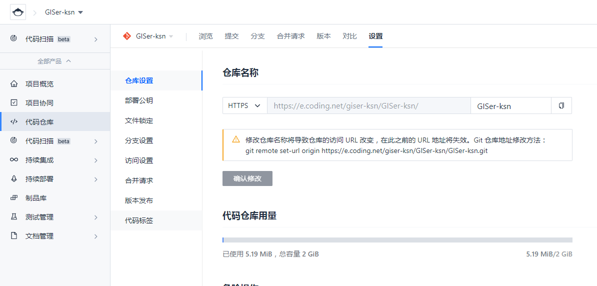

## 4、远端部署

```
$ hexo clean
$ hexo g
$ hexo d
```

这样本地博客就能同时同步到github和coding

## 5、静态网站部署

点击项目左边菜单栏 持续部署→静态网站

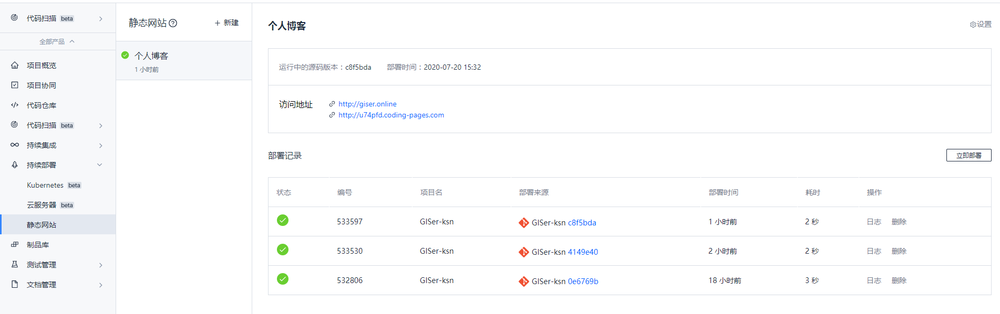

<br>

# 二、设置个人域名

## 1、购买域名

注册一个阿里云账户,在[阿里云](https://wanwang.aliyun.com/?spm=5176.8142029.digitalization.2.e9396d3e46JCc5)上买一个域名，我买的是 `giser.online`（是最便宜的，8块钱一年），各个后缀的价格不太一样，之后实名认证，然后在域名控制台中看到你购买的域名。

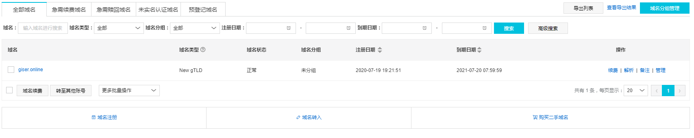

## 2、解析域名

点击上图解析，增加一条CNAME信息，记录值为部署静态网站中的访问地址，此为境内访问coding

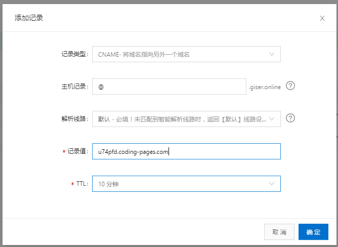

继续解析，增加一条CNAME信息，记录值为youruser.github.io （youruser为你的github用户名）,此为境外访问github

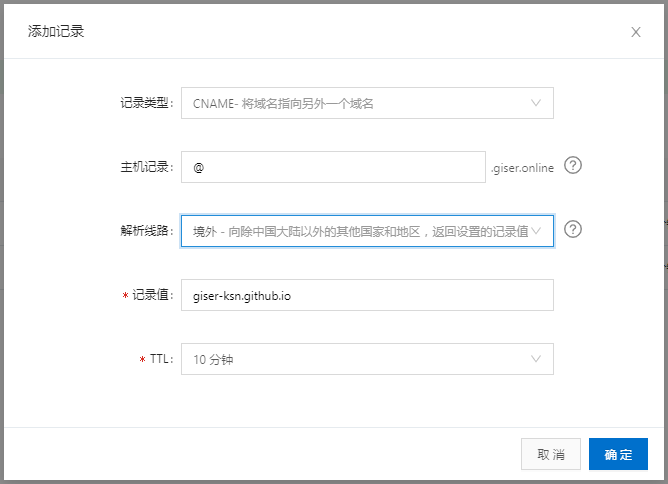

最终结果为下图：

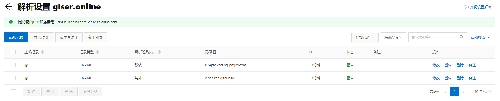

## 3、绑定域名

登录github，进入之前创建的仓库，点击settings，设置Custom domain，输入你的域名

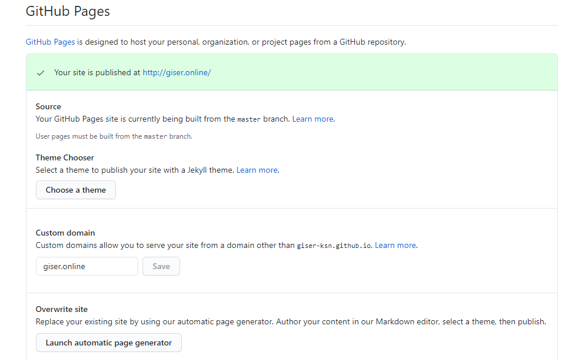

登录coding，进入之前创建的仓库，点击静态网站→右上角设置→自定义域名，输入你的域名

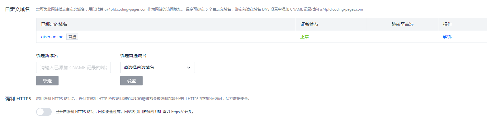

<br>

*<u>**ps：此方法只需要花点小钱买个域名，不需要专门去买服务器，完成上述操作后需耐心等待一段时间就能登录自己的域名访问博客（现在国内政策是域名要备案，不然要被封网站，不过好像备案需要买个服务器，购买服务器可是一笔不小的开支）**</u>*